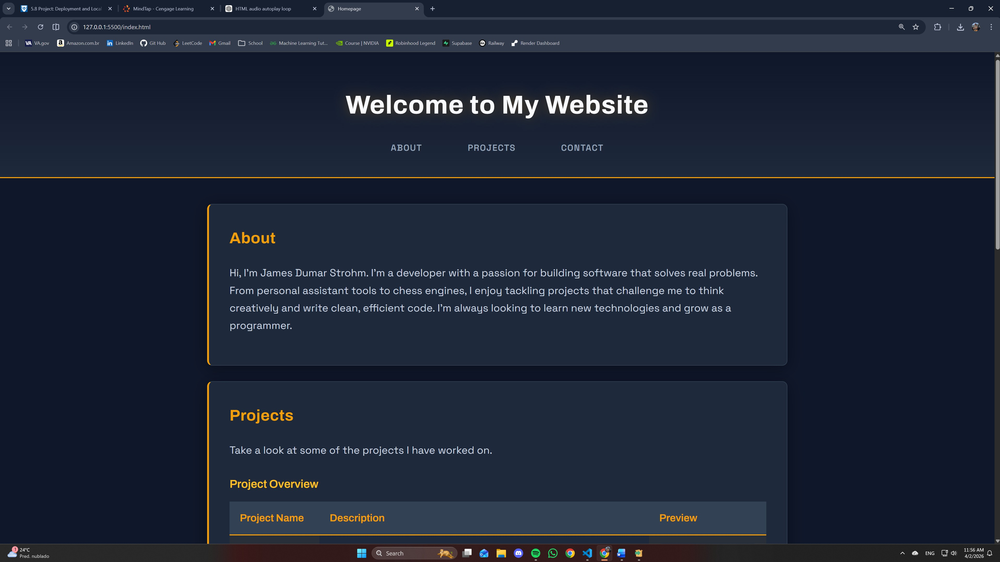

# Workspace Creation Portfolio

## Description
Welcome to my portfolio repository. This website highlights my projects, technical skills, and work in web development. It includes examples of applications and software projects I've built, along with a brief overview of the technologies I use.

## Screenshot


## Installation
Clone the repository and open it locally:

```bash
git clone https://github.com/jamesstrohm55/Workspace_Creation.github.io.git
cd Workspace_Creation.github.io
```

## Usage
To view the portfolio, open `index.html` in your web browser. From there, you can browse the different sections to explore my projects and learn more about my background and technical skills.

## Projects

### ALFRED (All-Knowing Logical Facilitator for Reasoned Execution of Duties)
A modular AI assistant built with a FastAPI REST API, voice CLI, and PySide6 GUI, all connected to a shared Supabase backend. It includes:

- Multi-provider LLM fallback chain
- RAG pipeline with `pgvector` semantic memory
- API key authentication
- Per-user rate limiting
- Per-user conversation sessions
- Dockerized deployment
- Railway hosting
- GitHub Actions CI

### C++17 Chess Engine
A fully playable chess engine written in modern C++17 with both a console interface and an SDL2 graphical GUI. Features include:

- Human vs. human gameplay
- Human vs. AI gameplay
- Configurable AI difficulty
- Console-based interface
- SDL2 graphical interface

## Contributing
Contributions, suggestions, and feedback are welcome. Feel free to fork the repository and open a pull request with improvements.

## License
This project is licensed under the MIT License. See the `LICENSE` file for more information.

## Contact
You can reach me here:

- Email: `jamesstrohm98@gmail.com`
- GitHub: `jamesstrohm55`

## Notes
This portfolio is a living project and will continue to be updated as I build new applications and expand my skill set.
